# Unreal Engine Blueprint Diagrams

This file contains Mermaid diagrams showing how to set up blueprints in Unreal Engine to receive and use OSC data from the body tracking application.

## Basic Blueprint Structure


## Event Flow: Receiving OSC Data

```mermaid
sequenceDiagram
    participant App as Electron App
    participant OSC as OSC Server Component
    participant BP as Blueprint Event Graph
    participant Actor as Scene Actor
    
    App->>OSC: UDP Message on Port 8000
    Note over App,OSC: /pose/right_wrist/position<br/>[0.523, 0.612, -0.045]
    
    OSC->>BP: Trigger Bound Event
    Note over OSC,BP: OnRightHandPosition Event
    
    BP->>BP: Break OSC Message
    BP->>BP: Extract X, Y, Z (Floats)
    BP->>BP: ConvertMediaPipeToUnreal(X, Y, Z)
    BP->>BP: SmoothPosition (VInterp)
    BP->>Actor: Set Actor Location
    
    Actor-->>App: Visual Feedback (actor moves)
```

## Complete Blueprint: Single Hand Tracking

```mermaid
flowchart TD
    Start([Event BeginPlay]) --> GetOSC[Get OSC Server Component]
    GetOSC --> Bind[Bind Event to Address Pattern<br/>Pattern: /pose/right_wrist/position]
    Bind --> Ready[Ready to Receive]
    
    Ready -.-> Receive([On OSC Message Received])
    
    Receive --> Break[Break OSC Message]
    Break --> GetX[Get Float at Index 0 → X]
    Break --> GetY[Get Float at Index 1 → Y]
    Break --> GetZ[Get Float at Index 2 → Z]
    
    GetX --> Convert[ConvertMediaPipeToUnreal Function]
    GetY --> Convert
    GetZ --> Convert
    
    Convert --> Unreal[UnrealVector]
    Unreal --> Smooth[VInterp To<br/>Current → Target<br/>Speed: 10.0]
    Smooth --> SetLoc[Set Actor Location]
    SetLoc --> Update[Update Visual]
    
    style Start fill:#90EE90
    style Receive fill:#87CEEB
    style Convert fill:#FFD700
    style SetLoc fill:#FF6B6B
```



## Complete Blueprint: Full Body IK Setup


## Function: ConvertMediaPipeToUnreal

```mermaid
flowchart LR
    Input1[X: Float 0.0-1.0] --> Calc1
    Input2[Y: Float 0.0-1.0] --> Calc2
    Input3[Z: Float depth] --> Calc3
    
    Calc1["UnrealX = (X - 0.5) × 1000"] --> MakeVec[Make Vector]
    Calc2["UnrealZ = (1.0 - Y) × 1000"] --> MakeVec
    Calc3["UnrealY = Z × -100"] --> MakeVec
    
    MakeVec --> Output[Return: FVector]
    
    style Input1 fill:#E6F3FF
    style Input2 fill:#E6F3FF
    style Input3 fill:#E6F3FF
    style Output fill:#90EE90
```



## Blueprint Component Hierarchy


## Variables Setup


## Advanced: Gesture Detection Blueprint


## Data Flow: App to Unreal


## OSC Message Types

```mermaid
graph TD
    A[OSC Messages from App] --> B[Individual Landmarks]
    A --> C[Bundle Message]
    A --> D[Visibility Data]
    
    B --> B1["/pose/nose/position"]
    B --> B2["/pose/right_wrist/position"]
    B --> B3["/pose/left_ankle/position"]
    B --> B4["... 33 total landmarks"]
    
    C --> C1["/pose/all"]
    C1 --> C2["99 floats (33 × 3)"]
    
    D --> D1["/pose/nose/visibility"]
    D --> D2["... confidence values"]
    
    B1 --> E[Float, Float, Float]
    B2 --> E
    B3 --> E
    
    C2 --> F["[x1,y1,z1, x2,y2,z2, ...]"]
    
    D1 --> G[Float 0.0-1.0]
    
    style A fill:#FFD700
    style B fill:#87CEEB
    style C fill:#90EE90
    style D fill:#FFB6C1
```



## Quick Setup Flowchart


---

## Usage

You can view these diagrams by:
1. **GitHub/GitLab**: Automatically renders in markdown preview
2. **VS Code**: Install "Markdown Preview Mermaid Support" extension
3. **Online**: Copy to https://mermaid.live
4. **Documentation**: Use in your project wiki/docs

## Diagram Legend

- 🟢 **Green nodes**: Start/Success states
- 🔵 **Blue nodes**: Processing/Events
- 🟡 **Yellow nodes**: Important actions
- 🔴 **Red nodes**: End states/Updates
- ⬜ **White nodes**: Standard flow

---

These diagrams map directly to the blueprint setup described in `UNREAL_INTEGRATION.md` and `UNREAL_EXAMPLES.md`.
